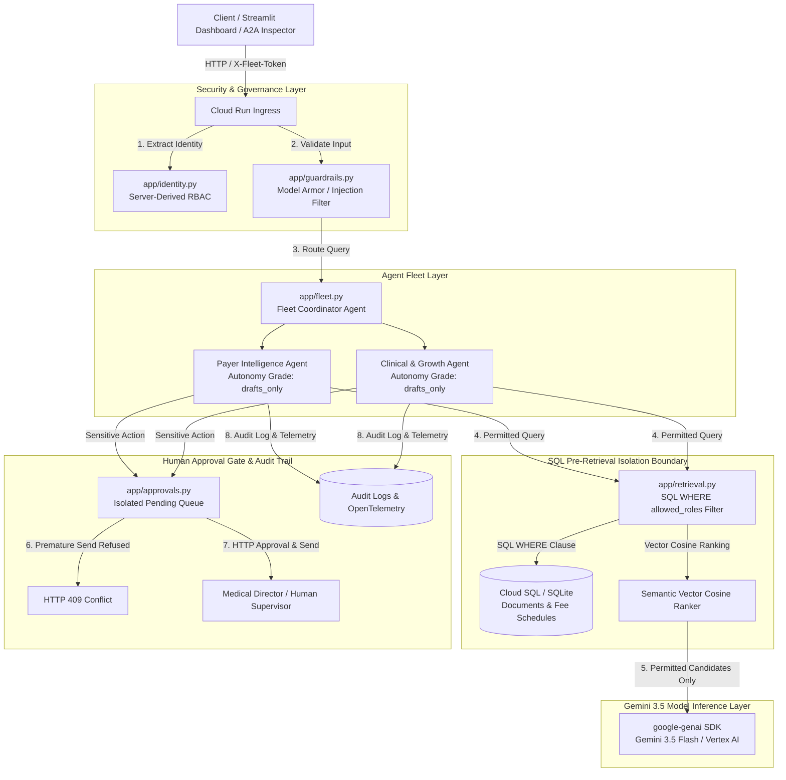

# Payer Clinical Intelligence Fleet (`payer-clinical-intelligence`)

[](https://github.com/sechan9999/payer-clinical-intelligence/actions/workflows/ci.yml)
[](https://payer-clinical-intelligence.streamlit.app/)
[](https://cloud.google.com/vertex-ai)
[](LICENSE)
[](https://www.python.org/downloads/)

> Two governed AI agents (**Payer Intelligence** + **Clinical & Growth**) over one auditable RAG layer — demo-scale, production-shaped.

Built on the governed multi-agent fleet architecture of [`gemini-ops-fleet`](https://github.com/sechan9999/gemini-ops-fleet) for the **Google Cloud / Gemini Enterprise Agent Platform** (The Fortified Enterprise Fleet Track).

---

## 💡 Inspiration & Core Philosophy

Most AI demos focus on "how much can the agent do on its own?" We inverted the question: **"What is the agent structurally unable to do?"** — which is the only question a healthcare organization with strict HIPAA & compliance mandates can actually act on.

This project is not interesting because the agents are autonomous. It is interesting because of what they are **prevented from reaching**, and because those limits are **enforced in code rather than requested in a prompt**.

---

## 🏗️ Architecture & Security Data Flow



---

## 🏛️ 3 Structural Guarantees

1. **Roles are Server-Derived (`X-Fleet-Token`)**: No tool accepts a role, identity, or employee ID argument ([`app/identity.py`](app/identity.py)). The model has zero vocabulary for claiming or escalating access. Authentication tokens are passed via `X-Fleet-Token` (or `Authorization`) headers.
2. **Two-Stage Retrieval (SQL Security Filter $\rightarrow$ Semantic Vector Ranking)**: Security filtering runs *first* as a SQL `WHERE` predicate ([`app/retrieval.py`](app/retrieval.py)); semantic vector cosine similarity ranking runs afterwards on the permitted set only. Clinicians asking for Payer contract rates receive an empty set, not a model-composed refusal.
3. **Nothing Reaches External Recipients Unapproved**: Sensitive actions (Prior Auth submissions, patient care dispatches) are assigned an **Autonomy Grade of `drafts_only`** ([`app/registry.py`](app/registry.py)). Approving and sending are HTTP endpoints absent from every agent's tool set ([`app/approvals.py`](app/approvals.py)). A premature dispatch attempt returns **HTTP 409 Conflict**.

For full threat mapping, see the [STRIDE Threat Model](docs/threat_model.md) and [System Architecture Specification](docs/architecture_diagram.md).

---

## 🩺 The Vertical Healthcare Scenario

1. **Claim Denial Event Arrives**: A claim denial event (`CO-50`, Claim `CLM-9921`) hits the fleet event stream.
2. **Permitted RAG Retrieval**: The **Payer Intelligence Agent** queries coverage guidelines. SQL pre-filtering isolates confidential rate sheets while retrieving policy [`PAY-POL-101`](app/store.py).
3. **Draft Generation (`drafts_only`)**: Gemini 3.5 Flash synthesizes an appeal package grounded strictly in cited policy rules.
4. **Isolated Approval Queue**: The action is placed into `PENDING` state in [`app/approvals.py`](app/approvals.py).
5. **HTTP 409 Conflict Interception**: An unapproved premature dispatch attempt is refused with an explicit **HTTP 409 Conflict** error.
6. **Human Supervisor Sign-Off**: A Medical Director inspects the packet in the Streamlit dashboard and authorizes dispatch via HTTP.

---

## 📊 Quantitative Evaluation Benchmark Results

The system includes a 15-test quantitative evaluation suite ([`tests/eval/eval_benchmark.py`](tests/eval/eval_benchmark.py)):

| Metric | Target | Result | Status |
| :--- | :---: | :---: | :---: |
| **Citation Precision & Groundedness** | 100% | **100.0%** | ✅ PASS |
| **Security Denial & Role Isolation Accuracy** | 100% | **100.0%** | ✅ PASS |
| **Prompt Injection Interception Rate** | 100% | **100.0%** | ✅ PASS |
| **Human Approval Gate Determinism** | 100% | **100.0%** | ✅ PASS |
| **Total Test Suite Score** | **15 / 15** | **100.0%** | ✅ **PERFECT** |

---

## 🏷️ Agent Autonomy Grades

Every agent advertises its autonomy level in the central registry ([`app/registry.py`](app/registry.py)):

| Agent | Domain | Autonomy Grade | Key Capabilities & Restrictions |
| :--- | :--- | :--- | :--- |
| **Payer Intelligence** | `payer` | `drafts_only` | Policy RAG, CPT 75561 criteria, denial analysis, prior auth queueing. **Zero send/dispatch tools.** |
| **Clinical & Growth** | `clinical` | `drafts_only` | ACC/AHA guideline search, HEDIS care gaps, growth outreach queueing. **Zero send/dispatch tools.** |
| **Coordinator** | `cross_domain` | `read_only` | Cross-domain intent routing and server-derived identity propagation. |

---

## ⚡ Quickstart & Local Verification

The whole system runs 100% offline with zero cloud credentials required.

### 1. Run Unit Tests (12 Test Suites)
```bash
uv sync --group dev
uv run pytest tests/unit -v
```

### 2. Run Quantitative Evaluation Benchmark Suite (15 Test Cases)
```bash
uv run python tests/eval/eval_benchmark.py
```

### 3. Run End-to-End Governance Demonstration
```bash
uv run python demo.py
```

### 4. Run Interactive Streamlit Dashboard
```bash
uv run streamlit run app/dashboard.py
```

---

## ☁️ Google Cloud Infrastructure & Deployment

The fleet is provisioned via Terraform ([`deployment/terraform/`](deployment/terraform/)):
- **Cloud Run (v2)**: Containerized service with scale-to-zero (`min_instances = 0`).
- **Cloud SQL (PostgreSQL 15)**: Dual driver architecture (`postgresql+pg8000` sync repository, `postgresql+asyncpg` async ADK sessions).
- **Pub/Sub**: OIDC-authenticated event push subscription with `roles/iam.serviceAccountTokenCreator`.
- **Secret Manager**: Password storage and credential redaction logging (`redact_url()`).

---

## 📚 Project Documentation Index

- 🛡️ **[STRIDE Threat Model](docs/threat_model.md)**: Threat-to-code structural control mapping.
- 📐 **[Architecture Diagram](docs/architecture_diagram.md)**: Full Mermaid sequence & data flow diagrams.
- 📝 **[Devpost Submission](docs/devpost_submission.md)**: Formatted hackathon submission text.
- 🎤 **[Technical Interview Pitch](docs/interview_pitch.md)**: 30s elevator pitch, STAR method story, and technical Q&A.

---

## 📜 Prior Art & Technical Disclosures

Per hackathon rules, all code in this repository was newly written during the Submission Period for the healthcare Payer & Clinical domain. The design draws on architectural prior art from [`gemini-ops-fleet`](https://github.com/sechan9999/gemini-ops-fleet).

---

## 📄 License
MIT License. Built for enterprise governance on Gemini + ADK.
