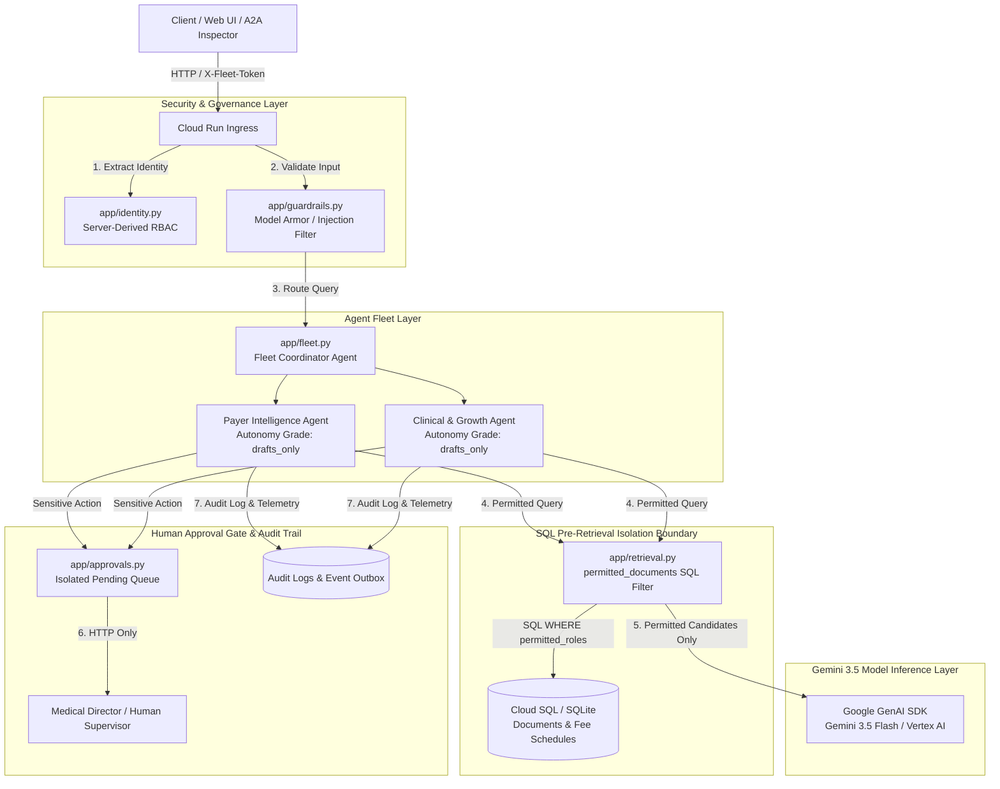
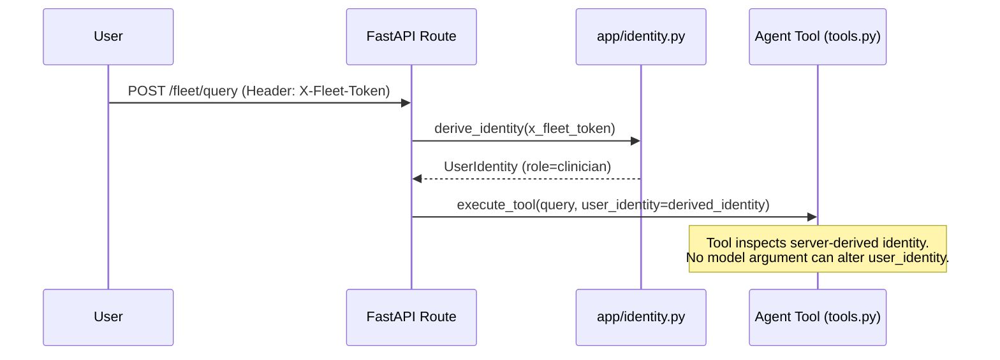
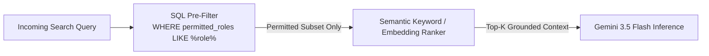
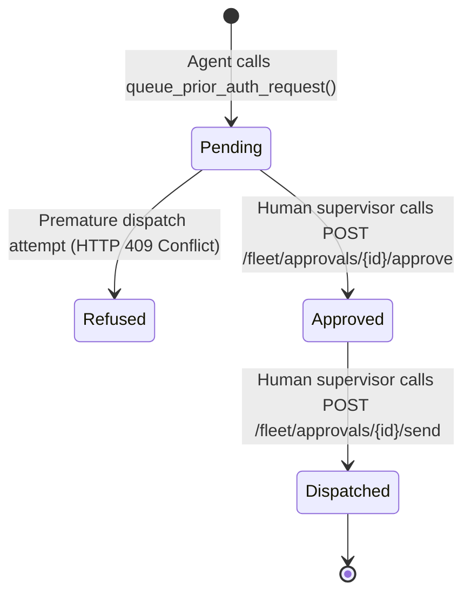

# Architecture Specification & System Diagrams

`payer-clinical-intelligence` is a governed multi-agent back-office intelligence system for healthcare payers and providers, built on **Gemini 3.5 Flash**, **Google Agent Development Kit (ADK)**, and **Google Cloud Platform (Cloud Run, Cloud SQL, Pub/Sub, Secret Manager)**.

---

## 🏗️ System Architecture & Data Flow

---

## 🔒 3 Core Governance Patterns

### Pattern 1: Server-Derived Role Immutability
No tool accepts a `role`, `identity`, or `employee_id` parameter. The model has zero vocabulary for claiming or escalating access. Authentication tokens are derived server-side from `X-Fleet-Token` or `Authorization` headers.

---

### Pattern 2: Separation of Security Filtering from Relevance Ranking

Security pre-filtering runs as a SQL `WHERE` clause BEFORE candidates enter semantic ranking. Restricted documents never enter memory, preventing prompt leakage or accidental citation.

---

### Pattern 3: Isolated Human Approval Gate (Pending $\rightarrow$ Approved $\rightarrow$ Dispatched)

Actions involving patient outreach or prior authorization filings are given an **Autonomy Grade of `drafts_only`**. Sending and dispatching paths are HTTP endpoints absent from all agent tool definitions. Premature dispatch attempts return **HTTP 409 Conflict**.

---

## ☁️ Google Cloud Infrastructure Layout

- **Cloud Run (v2)**: Stateless server container scaled to zero (`min_instances = 0`).
- **Cloud SQL (PostgreSQL 15)**: Dual database driver connection (`postgresql+pg8000` for sync repository, `postgresql+asyncpg` for async session store).
- **Pub/Sub**: Activity event outbox push subscription with OIDC authentication.
- **Secret Manager**: Secure storage for database passwords.
- **Vertex AI & Model Armor**: Pinned `gemini-3.5-flash` model inference and enterprise safety templates.
